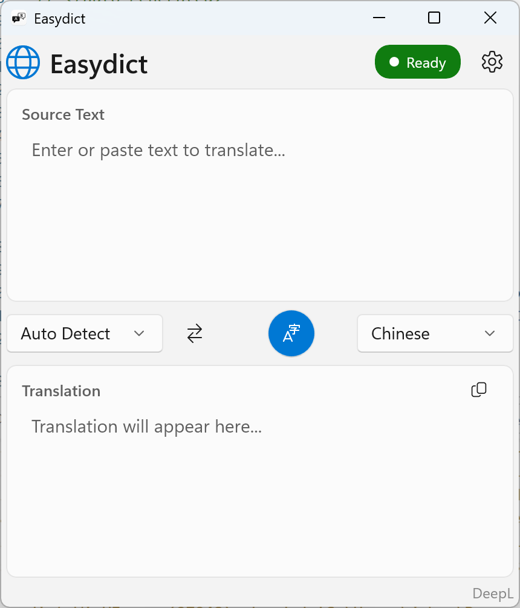
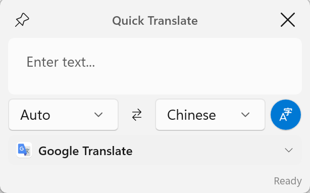

# easydict_win32

[](https://github.com/xiaocang/easydict_win32/actions/workflows/ci.yml)

## Introduction

This is a Windows port of [Easydict](https://github.com/tisfeng/Easydict), originally a macOS translation dictionary app. The project was developed using **Vibe Coding** - AI-assisted programming to migrate the Swift/SwiftUI codebase to .NET 8 + WinUI 3.

While the feature set is not yet complete compared to the macOS version, this port fills the gap for Windows users who want a convenient translation tool with global hotkey support and multiple translation services.

## Tech Stack

- **.NET 8** - Runtime framework
- **WinUI 3 (Windows App SDK)** - Modern Windows UI framework
- **C# 12** - Programming language
- **xUnit + FluentAssertions** - Unit testing

## Features

### Implemented

- **Multiple Translation Services**
  - Google Translate (free, no API key required)
  - DeepL (supports Free/Pro API, Traditional Chinese supported)
  - OpenAI (GPT-4o, GPT-4o-mini, etc.)
  - Gemini (Google AI, including Gemini 2.5 models)
  - DeepSeek
  - Groq (fast LLM inference)
  - Zhipu AI
  - GitHub Models (free)
  - Doubao (ByteDance translation-specialized model)
  - Caiyun (彩云小译, Traditional Chinese supported)
  - NiuTrans (小牛翻译, 450+ languages, Traditional Chinese supported)
  - Linguee Dictionary (with context examples)
  - Ollama (local LLM, default: llama3.2)
  - BuiltIn AI (free, powered by Groq)
  - Custom OpenAI-compatible services

- **LLM Streaming Translation** - Real-time display of translation results

- **Multiple Window Modes**
  - Main Window - Full translation interface
  - Mini Window - Compact floating window
  - Fixed Window - Persistent translation window

- **Global Hotkeys**
  - `Ctrl+Alt+T` - Show/hide main window
  - `Ctrl+Alt+D` - Translate clipboard content
  - `Ctrl+Alt+M` - Show mini window (copies selection and translates when available)
  - `Ctrl+Alt+F` - Show fixed window
  - `Ctrl+Alt+Shift+M` - Toggle mini window visibility
  - `Ctrl+Alt+Shift+F` - Toggle fixed window visibility

- **System Tray** - Minimize to tray, run in background

- **Clipboard Monitoring** - Auto-translate copied text

- **HTTP Proxy Support** - Configure proxy server

- **High DPI Support** - Per-Monitor V2 DPI awareness

- **Dark/Light Theme** - Follows system theme

### Screenshots

| Main Window | Mini Window |
|-------------|-------------|
|  |  |

## Installation

### System Requirements

- Windows 10 version 1809 (build 17763) or later
- x64, x86, or ARM64 processor

### Download

Download from the [Releases](https://github.com/xiaocang/easydict_win32/releases) page.

#### Portable Version (Recommended)

**File:** `easydict_win32-vX.Y.Z-x64.zip`

- No installation required - extract and run
- No administrator privileges needed
- Self-contained (.NET runtime included)
- First run may trigger Windows SmartScreen warning - click "More info" → "Run anyway"

```powershell
# Extract and run
Expand-Archive easydict_win32-v1.0.0-x64.zip -DestinationPath Easydict
.\Easydict\Easydict.WinUI.exe
```

#### MSIX Package

**File:** `Easydict-vX.Y.Z-x64.msix`

- Windows native installer format
- Integrates with Start Menu and system features
- Prepared for future Windows Store release
- **Requires certificate trust** (self-signed builds)

```powershell
# For self-signed MSIX, you may need to install the certificate first
# Or enable Developer Mode: Settings → Privacy & security → For developers

# Install the package
Add-AppxPackage -Path Easydict-v1.0.0-x64.msix
```

> **Note:** MSIX packages from GitHub Releases use self-signed certificates.
> Users must trust the certificate before installation. For easier installation,
> use the Portable version or wait for the Windows Store release.

#### Verify Download (Optional)

Each release includes SHA256 checksums for verification.

**Note:** The checksum file contains entries for both MSIX and ZIP files.
If you downloaded only one file, use the single-file verification method below.

```bash
# Linux/macOS/WSL - Verify all files in current directory
sha256sum -c checksums-x64.sha256

# Linux/macOS/WSL - Verify single file (ignore missing files)
sha256sum -c checksums-x64.sha256 --ignore-missing

# PowerShell - Verify single file manually
$expected = (Get-Content checksums-x64.sha256 | Select-String "easydict_win32").ToString().Split()[0]
$actual = (Get-FileHash easydict_win32-v1.0.0-x64.zip -Algorithm SHA256).Hash.ToLower()
if ($expected -eq $actual) { "OK" } else { "FAILED" }
```

### Build from Source

```powershell
# Clone repository
git clone https://github.com/xiaocang/easydict_win32.git
cd easydict_win32/dotnet

# Build
dotnet build src/Easydict.WinUI/Easydict.WinUI.csproj -c Release

# Run
dotnet run --project src/Easydict.WinUI/Easydict.WinUI.csproj
```

## Recent Updates

### January 2026

**Translation Service Improvements:**

- **Gemini Service** - Added 4 new models:
  - `gemini-2.5-flash-lite` (lightweight, 500 RPD free tier)
  - `gemini-2.5-pro` (advanced model)
  - `gemini-3-flash-preview` (Gemini 3 Flash preview)
  - `gemini-3-pro-preview` (Gemini 3 Pro preview)

- **DeepL Service** - Added Traditional Chinese support
  - Both API and web translation modes now support Traditional Chinese
  - Proper `ZH-HANT` language code mapping

- **Doubao Service** - Complete rewrite with correct API
  - Now uses ByteDance's specialized translation API (`/api/v3/responses`)
  - Translation-specific model: `doubao-seed-translation-250915`
  - Improved streaming support with proper SSE event parsing
  - Added Traditional Chinese support with `zh-Hant` language code

- **Google Translate** - Hebrew language support verified and working correctly

## TODO

### High Priority

- [x] ~~**Doubao**~~ - ByteDance LLM service ✅ **Implemented**
- [x] ~~**Caiyun**~~ - 彩云小译 ✅ **Implemented**
- [x] ~~**NiuTrans**~~ - 小牛翻译 (450+ languages) ✅ **Implemented**
- [x] ~~**Linguee Dictionary**~~ - Dictionary with context examples ✅ **Implemented**
- [ ] **TTS (Text-to-Speech)** - Windows Speech Synthesis API

### Medium Priority

- [ ] **More Translation Services**
  - [ ] Volcano (ByteDance, may overlap with Doubao)

- [ ] **AI Tools**
  - [ ] Text Polishing
  - [ ] Text Summarization

- [ ] **More Hotkeys**
  - [ ] Polish and replace
  - [ ] Translate and replace

### Low Priority

- [ ] **Dictionary Mode** - Word definitions, pronunciation
- [ ] **Smart Query** - Auto-select translation mode based on text type
- [ ] **Multi-language UI** - UI localization
- [ ] **Auto Update** - Check and install updates

## Comparison with macOS Version

| Feature | macOS | Windows |
|---------|-------|---------|
| Translation Services | 25+ | 15 |
| OCR Screenshot Translation | Yes | No |
| TTS | Yes | Planned |
| Selection Translation | Yes | Yes |
| Window Types | 3 | 3 |
| Global Hotkeys | 10+ | 6 |
| LLM Streaming | Yes | Yes |
| Traditional Chinese | Yes | Yes |

## License

GPL-3.0 - For learning and communication purposes only. License and copyright notice must be included when using source code.

## Acknowledgements

- [Easydict](https://github.com/tisfeng/Easydict) - Original macOS version
- [Windows App SDK](https://github.com/microsoft/WindowsAppSDK) - WinUI 3 framework

---

*This project was developed using Vibe Coding, with AI-assisted programming by Claude (Anthropic).*
