<p align="center">
  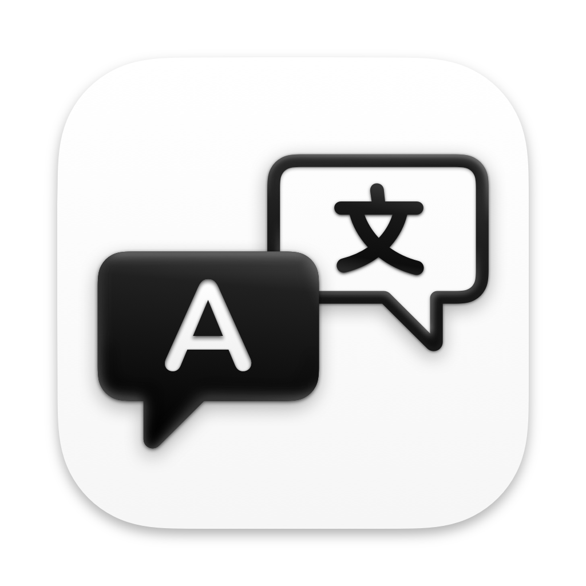
  <h1 align="center">Easydict <sup><sub>for Windows</sub></sup></h1>
  <h4 align="center">Easy to look up words or translate text</h4>
  <p align="center">A Windows port of <a href="https://github.com/tisfeng/Easydict">Easydict</a></p>
</p>

<div align="center">
<a href="./README.md">English</a> &nbsp;&nbsp;|&nbsp;&nbsp; <a href="./README_ZH.md">中文</a>
</div>

<div align="center">

[](https://github.com/xiaocang/easydict_win32/actions/workflows/ci.yml) [](https://www.gnu.org/licenses/gpl-3.0) 

</div>

## Table of Contents

- [Introduction](#introduction)
- [Screenshots](#screenshots)
- [Features](#features)
- [Installation](#installation)
- [Tech Stack](#tech-stack)
- [Translation Service Integration Tests](#translation-service-integration-tests)
- [TODO](#todo)
- [Comparison with macOS Version](#comparison-with-macos-version)
- [License](#license)
- [Acknowledgements](#acknowledgements)

## Introduction

This is a Windows port of [Easydict](https://github.com/tisfeng/Easydict), originally a macOS translation dictionary app. The current default release is a Rust-native portable app; the older .NET/WinUI build is retained only for legacy/hybrid coexistence work.

Easydict supports **Copilot+ PC enhanced local AI translation**: on supported Copilot+ PCs with a 40+ TOPS NPU, translations run on-device via Phi Silica for fast, private output. Foundry Local is supported on regular Windows PCs, with OpenVINO NLLB-200 as an offline fallback — standard translation services remain fully available on every Windows device.

While the feature set is not yet complete compared to the macOS version, this port fills the gap for Windows users who want a convenient translation tool with global hotkey support and multiple translation services.

<p align="right"><a href="#table-of-contents">Back to Top</a></p>

## Screenshots

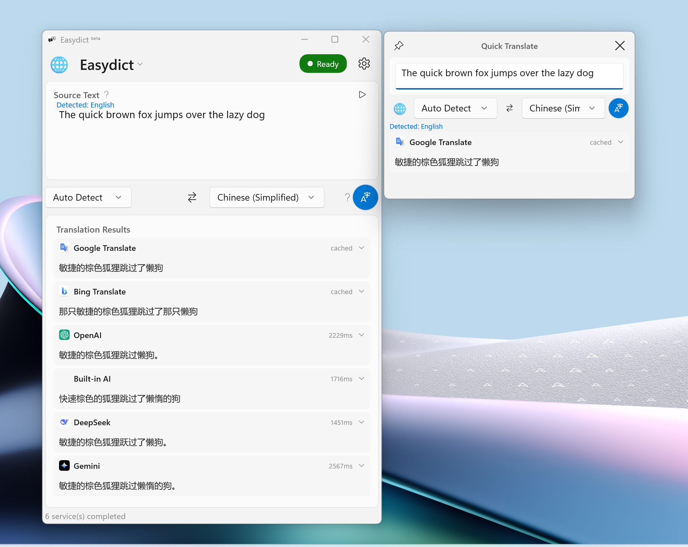

*Main Window with Mini Window (Quick Translate)*

| Main Window | All Windows | Settings |
|-------------|-------------|----------|
| 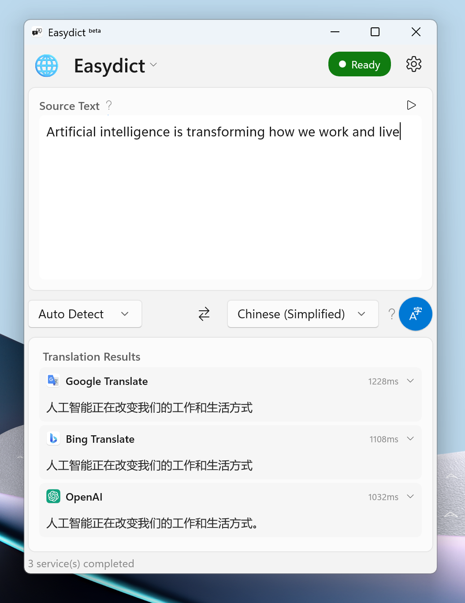 | 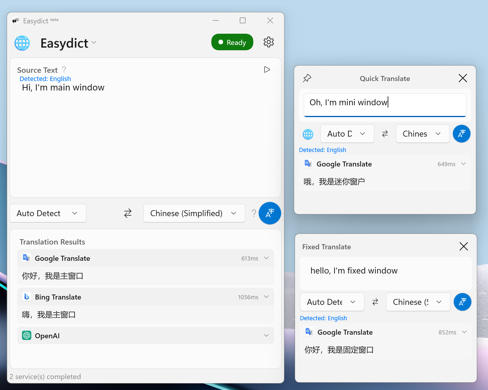 | 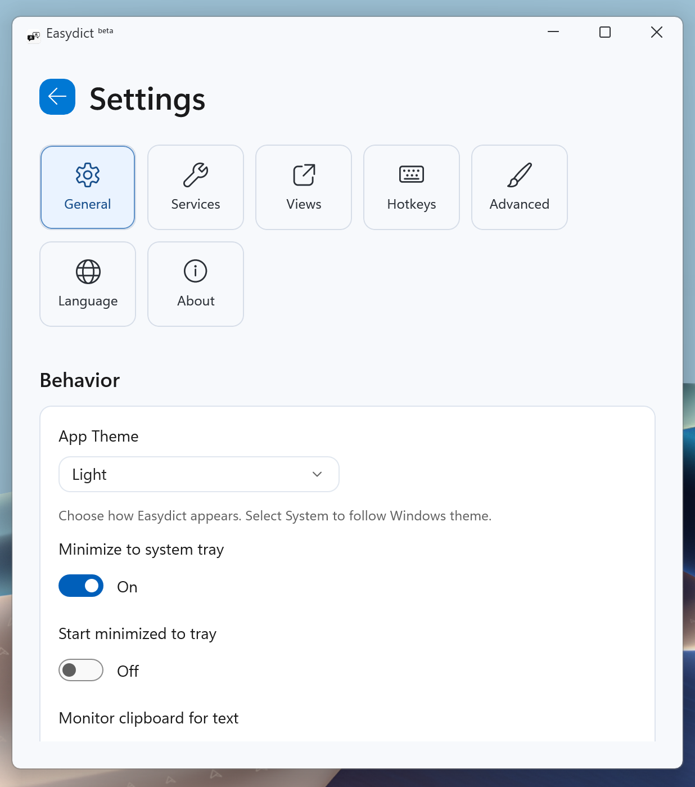 |
| Full translation interface | Main + Mini + Fixed windows with hotkey settings | Service configuration |

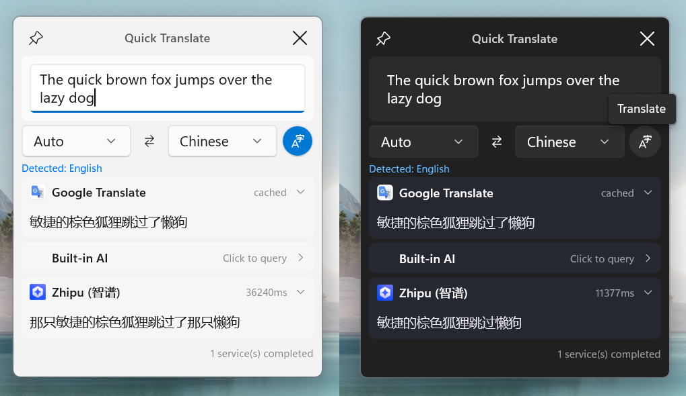

*Light & Dark Mode — Mini Window (Quick Translate)*

| Grammar Correction | Dictionary Mode | Long Document Translation |
|---|---|---|
| 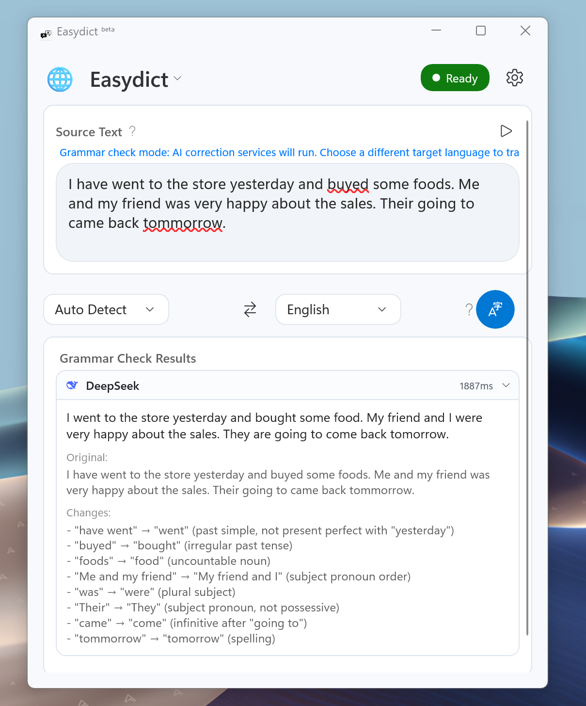 | 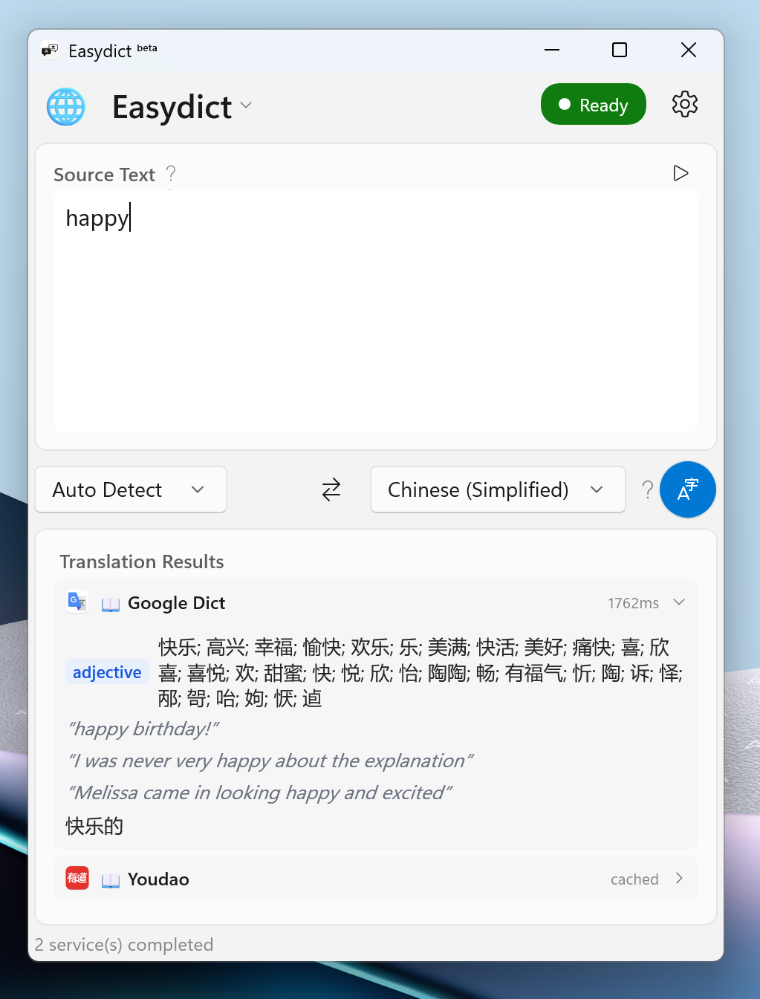 | 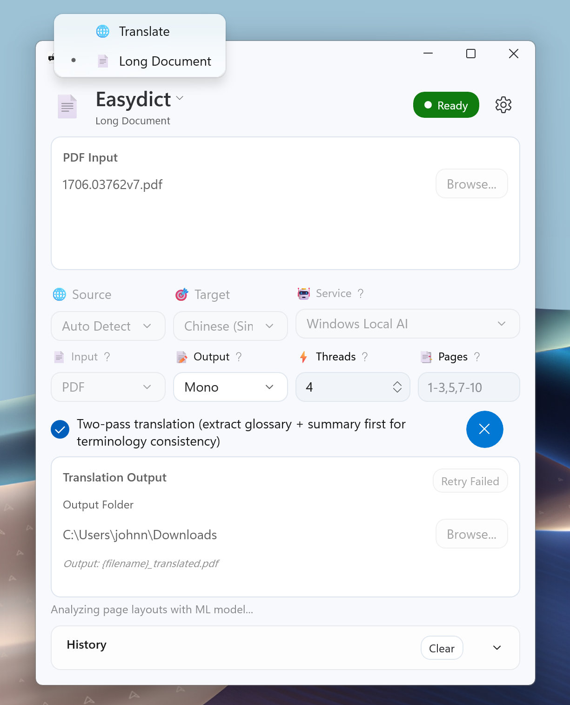 |
| AI-powered grammar correction | Word definitions, phonetics, and examples | PDF/Text/Markdown translation with progress |

| OCR Screenshot Translate | Mouse Selection Translate |
|---|---|
| 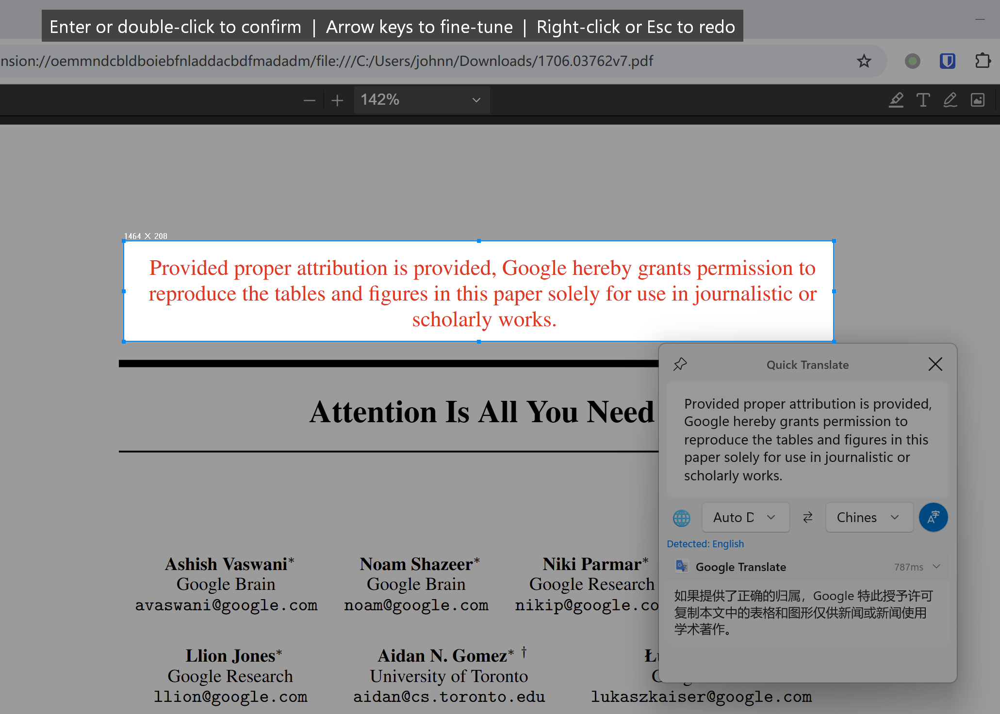 | 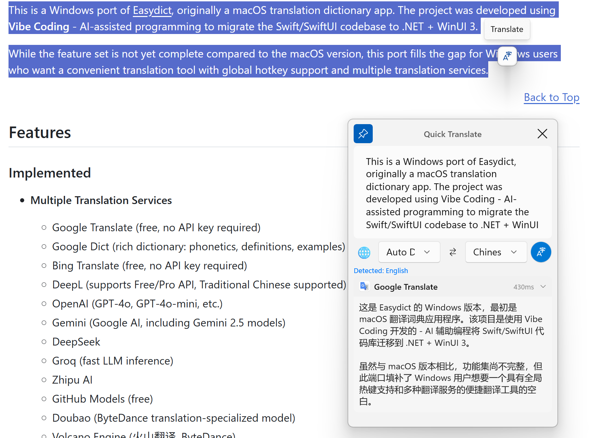 |
| Capture screen region → OCR → translate | Select text in any app → click to translate |

<p align="right"><a href="#table-of-contents">Back to Top</a></p>

## Features

- **Copilot+ PC Enhanced Local AI Translation** - Windows Local AI runs on-device with NPU acceleration via Phi Silica on supported Copilot+ PCs (40+ TOPS), Foundry Local on regular Windows PCs, or OpenVINO NLLB-200 as an offline fallback. Auto mode picks the best available provider; standard cloud translation services remain fully available everywhere.

- **OCR Screenshot Translate** - Snipaste-style screen capture: press `Ctrl+Alt+S` to capture a screen region, auto-detect windows or drag to select, then OCR the text and translate. Uses Windows OCR API with configurable recognition language. Also supports silent OCR (`Ctrl+Alt+Shift+S`) that copies recognized text to clipboard without translating.

- **Mouse Selection Translate** - Select text in any app (drag, double-click, or triple-click) and click the floating pop button to translate instantly in Mini Window

- **Grammar Correction Mode** - AI-powered grammar correction that highlights errors and provides corrected text with explanations

- **Long Document Translation** - Translate PDF, plain text, and Markdown documents with ML-based layout detection, formula protection, parallel processing, bilingual output, and translation cache

- **Dictionary Mode** - Word definitions, phonetics, and example sentences powered by Google Dict. Linguee is currently unavailable because its upstream sample API no longer resolves.

- **MDX Dictionary** - Import MDict (.mdx) dictionary files for offline word lookups with rich HTML rendering

- **Global Hotkeys**
  - `Ctrl+Alt+T` - Show/hide main window
  - `Ctrl+Alt+D` - Translate clipboard content
  - `Ctrl+Alt+M` - Show mini window (copies selection and translates when available)
  - `Ctrl+Alt+F` - Show fixed window
  - `Ctrl+Alt+S` - OCR screenshot translate
  - `Ctrl+Alt+Shift+S` - Silent OCR (copy recognized text to clipboard)
  - `Ctrl+Alt+Shift+M` - Toggle mini window visibility
  - `Ctrl+Alt+Shift+F` - Toggle fixed window visibility

- **Multiple Window Modes**
  - Main Window - Full translation interface
  - Mini Window - Compact floating window
  - Fixed Window - Persistent translation window

- **LLM Streaming Translation** - Real-time display of translation results

- **System Tray** - Minimize to tray, run in background

- **Clipboard Monitoring** - Auto-translate copied text

- **Shell Context Menu** - Right-click any file or desktop background → "OCR Translate" to instantly capture and translate text on screen

- **Dark/Light Theme** - Follows system theme

- **TTS (Text-to-Speech)** - Play source and translated text using Windows Speech Synthesis

- **Multi-language UI** - Localized interface in 15 languages including English, Chinese (Simplified/Traditional), Japanese, Korean, French, German, Spanish, Portuguese, Italian, Russian, Arabic, Thai, Vietnamese, and Indonesian

- **40+ Languages** - Customizable language selection in Settings — choose which languages appear in source/target pickers from 40+ options spanning East Asian, European, Middle Eastern, South Asian, and Southeast Asian languages

- **HTTP Proxy Support** - Configure proxy server

- **High DPI Support** - Per-Monitor V2 DPI awareness

- **Multiple Translation Services** (19 available services; Linguee currently unavailable)
  - Google Translate (free, no API key required)
  - Google Dict (rich dictionary: phonetics, definitions, examples)
  - Bing Translate (free, no API key required)
  - DeepL (supports Free/Pro API, Traditional Chinese supported)
  - Youdao (Web + OpenAPI)
  - OpenAI (GPT-4o, GPT-4o-mini, etc.)
  - Gemini (Google AI, including Gemini 2.5 models)
  - DeepSeek
  - Groq (fast LLM inference)
  - Zhipu AI
  - GitHub Models (free)
  - Doubao (ByteDance translation-specialized model)
  - Volcano Engine (火山翻译, ByteDance)
  - Caiyun (彩云小译, Traditional Chinese supported)
  - NiuTrans (小牛翻译, 450+ languages, Traditional Chinese supported)
  - Linguee Dictionary (currently unavailable; upstream sample API is offline and disabled by default)
  - Ollama (local LLM, default: llama3.2)
  - Windows Local AI (Phi Silica on Copilot+ PCs, OpenVINO fallback)
  - BuiltIn AI (free, powered by Groq)
  - Custom OpenAI-compatible services

<p align="right"><a href="#table-of-contents">Back to Top</a></p>

## Installation

### System Requirements

- Windows 10 version 2004 (build 19041) or later
- x64 or ARM64 processor

### Download

Download from the [Releases](https://github.com/xiaocang/easydict_win32/releases) page.

#### Portable Version (Recommended)

**File:** `easydict-rs-portable-vX.Y.Z-win-x64.zip`

- No installation required - extract and run
- No administrator privileges needed
- Rust-native portable package; does not include the .NET runtime
- First run may trigger Windows SmartScreen warning - click "More info" → "Run anyway"

```powershell
# Extract and run
Expand-Archive easydict-rs-portable-v1.0.0-win-x64.zip -DestinationPath Easydict
.\Easydict\Easydict.Rust.exe
```

#### Legacy/Hybrid .NET Package and WinGet

The older `easydict_win32-vX.Y.Z-x64.zip` package and `Easydict.WinUI.exe`
entry point are retained only for legacy .NET / hybrid coexistence builds. They
are not the default rs portable package.

WinGet is a legacy/hybrid install path for the retained .NET package, not the
default Rust portable install path.

```powershell
winget install xiaocang.EasydictforWindows
```

#### Verify Download (Optional)

Each release includes SHA256 checksums for verification.

```bash
# Linux/macOS/WSL
sha256sum -c checksums-x64.sha256 --ignore-missing

# PowerShell
$expected = (Get-Content checksums-x64.sha256 | Select-String "easydict-rs-portable").ToString().Split()[0]
$actual = (Get-FileHash easydict-rs-portable-v1.0.0-win-x64.zip -Algorithm SHA256).Hash.ToLower()
if ($expected -eq $actual) { "OK" } else { "FAILED" }
```

### Build from Source

```powershell
# Clone repository
git clone https://github.com/xiaocang/easydict_win32.git
cd easydict_win32

# Build the default Rust portable package
cargo run --manifest-path rs\Cargo.toml -p easydict_packager -- pack-rs-portable --workspace rs --platform x64 --configuration Release

# Or run the Rust app directly during development
cd rs
cargo run -p easydict_app --bin easydict_preview
```

The `.\rs\scripts\Package-Portable.ps1` script remains as a compatibility wrapper around the same Rust packager command.

#### Legacy/Hybrid .NET Build

The .NET/WinUI build is retained only for legacy/hybrid coexistence work.

```powershell
cd easydict_win32/dotnet
dotnet build src/Easydict.WinUI/Easydict.WinUI.csproj -c Release
dotnet run --project src/Easydict.WinUI/Easydict.WinUI.csproj
```

<p align="right"><a href="#table-of-contents">Back to Top</a></p>

## Tech Stack

- **Rust** - Default portable app, core translation runtime, packaging, and native helpers
- **winfluent-rs / iced** - Rust desktop UI runtime
- **Windows APIs** - OCR, hotkeys, tray, protocol, and native integration
- **.NET 8 + WinUI 3** - Legacy/hybrid coexistence build and parity reference
- **cargo test + xUnit/FluentAssertions** - Rust and legacy parity tests

<p align="right"><a href="#table-of-contents">Back to Top</a></p>

## Translation Service Integration Tests

| Service | Protocol | Status | Notes |
|---------|----------|:------:|-------|
| Google Translate | REST | ✅ | Free, no API key |
| Bing Translate | REST | ✅ | Free, no API key |
| Youdao | REST | ✅ | Web + OpenAPI |
| OpenAI | OpenAI API | ✅ | |
| DeepSeek | OpenAI API | ✅ | |
| Gemini | Gemini API | ✅ | Custom SSE streaming |
| Zhipu AI | OpenAI API | ✅ | |
| Volcano Engine | REST | ✅ | HMAC-SHA256 signing |
| Groq | OpenAI API | — | OpenAI-compatible, missing API key |
| GitHub Models | OpenAI API | — | OpenAI-compatible, missing API key |
| Doubao | Custom SSE | — | Missing API key |
| DeepL | REST | — | Missing API key |
| Caiyun | REST | — | Missing API key |
| NiuTrans | REST | ✅ | |
| Linguee | REST | — | Unavailable: upstream sample API domain no longer resolves; integration tests are skipped by default |
| Google Dict | REST | ✅ | |
| Ollama | OpenAI API | — | Requires local Ollama setup |
| Windows Local AI | Local runtime | ✅ | TranslationManager routing tested; real inference requires Phi Silica, Foundry Local, or OpenVINO model |
| BuiltIn AI | OpenAI API | — | Embedded key |
| Custom OpenAI | OpenAI API | — | OpenAI-compatible, user-defined endpoint |

> Services marked **OpenAI API** extend `BaseOpenAIService` and share the same OpenAI-compatible implementation, so untested ones are expected to work similarly.

<p align="right"><a href="#table-of-contents">Back to Top</a></p>

## TODO

### High Priority

- [x] ~~**Doubao**~~ - ByteDance LLM service ✅ **Implemented**
- [x] ~~**Caiyun**~~ - 彩云小译 ✅ **Implemented**
- [x] ~~**NiuTrans**~~ - 小牛翻译 (450+ languages) ✅ **Implemented**
- [x] ~~**Linguee Dictionary**~~ - Dictionary with context examples ✅ **Implemented, currently unavailable**
- [x] ~~**TTS (Text-to-Speech)**~~ - Windows Speech Synthesis API ✅ **Implemented**
- [x] ~~**OCR Screenshot Translation**~~ - Snipaste-style screen capture with Windows OCR API ✅ **Implemented**

### Medium Priority

- [ ] **More Translation Services**
  - [x] ~~Volcano Engine~~ (火山翻译, ByteDance) ✅ **Implemented**

- [ ] **AI Tools**
  - [ ] Text Polishing
  - [ ] Text Summarization

- [ ] **More Hotkeys**
  - [ ] Polish and replace
  - [ ] Translate and replace

### Low Priority

- [x] ~~**Dictionary Mode**~~ - Word definitions, pronunciation ✅ **Implemented**
- [ ] **Smart Query** - Auto-select translation mode based on text type
- [x] ~~**Multi-language UI**~~ - UI localization (15 languages) ✅ **Implemented**
- [ ] **Auto Update** - Check and install updates

### Distribution

- [x] **Rust portable ZIP** - Default first rs release path
- [x] **Windows Store** - Legacy/hybrid package path
- [x] ~~**winget**~~ - Legacy/hybrid package path ✅

<p align="right"><a href="#table-of-contents">Back to Top</a></p>

## Comparison with macOS Version

| Feature | macOS | Windows |
|---------|-------|---------|
| Translation Services | 25+ | 20 |
| OCR Screenshot Translation | Yes | Yes |
| TTS | Yes | Yes |
| Selection Translation | Yes | Yes |
| Grammar Correction | No | Yes |
| Long Document Translation | No | Yes |
| Dictionary Mode | Yes | Yes |
| Window Types | 3 | 3 |
| Global Hotkeys | 10+ | 8 |
| LLM Streaming | Yes | Yes |
| Traditional Chinese | Yes | Yes |

<p align="right"><a href="#table-of-contents">Back to Top</a></p>

## Comparison with pdf2zh

[pdf2zh (PDFMathTranslate)](https://github.com/Byaidu/PDFMathTranslate) is a popular open-source PDF translation tool focused on scientific papers. The table below compares the long document translation capabilities of the two.

| Feature | pdf2zh | Easydict Win32 |
|---------|--------|----------------|
| Layout Detection | DocLayout-YOLO | ONNX (DocLayout-YOLO) / Vision LLM / Heuristic / Auto |
| Formula Protection | LaTeX preservation | Three-tier detection, multi-font glyph rendering, subscript/superscript handling |
| LLM Backends | OpenAI, Ollama, Azure OpenAI, etc. | OpenAI, Gemini, DeepSeek, Groq, Zhipu, GitHub Models, Doubao, Ollama, Custom OpenAI-compatible |
| Document Context Pass | No | Yes — glossary + summary + preservation hints extracted before block translation for terminology consistency |
| Translation Cache | No | Yes — SQLite cache keyed by source hash + service + language pair |
| Parallel Translation | Limited | Configurable concurrency with retry + quality feedback |
| OCR Fallback (Scanned PDF) | No | Yes — Windows OCR for image-only pages |
| CJK Font Handling | Basic | Built-in CJK font resolver + TrueType CMAP parser + automatic font download |
| Page Range Selection | Yes | Yes (`1-3,5,7-10` or `all`) |
| UI | CLI + minimal GUI | Native WinUI 3 app with progress, preview, cancellation |
| Integration | Standalone | Part of full translation dictionary app (OCR, selection, hotkeys, streaming, etc.) |
| Platform | Cross-platform (Python) | Windows 10/11 (native .NET 8) |

<p align="right"><a href="#table-of-contents">Back to Top</a></p>

## License

GPL-3.0 - For learning and communication purposes only. License and copyright notice must be included when using source code.

<p align="right"><a href="#table-of-contents">Back to Top</a></p>

## Acknowledgements

- [Easydict](https://github.com/tisfeng/Easydict) - Original macOS version
- [Windows App SDK](https://github.com/microsoft/WindowsAppSDK) - WinUI 3 framework

---

*This project was developed using Vibe Coding, with AI-assisted programming by Claude (Anthropic).*
