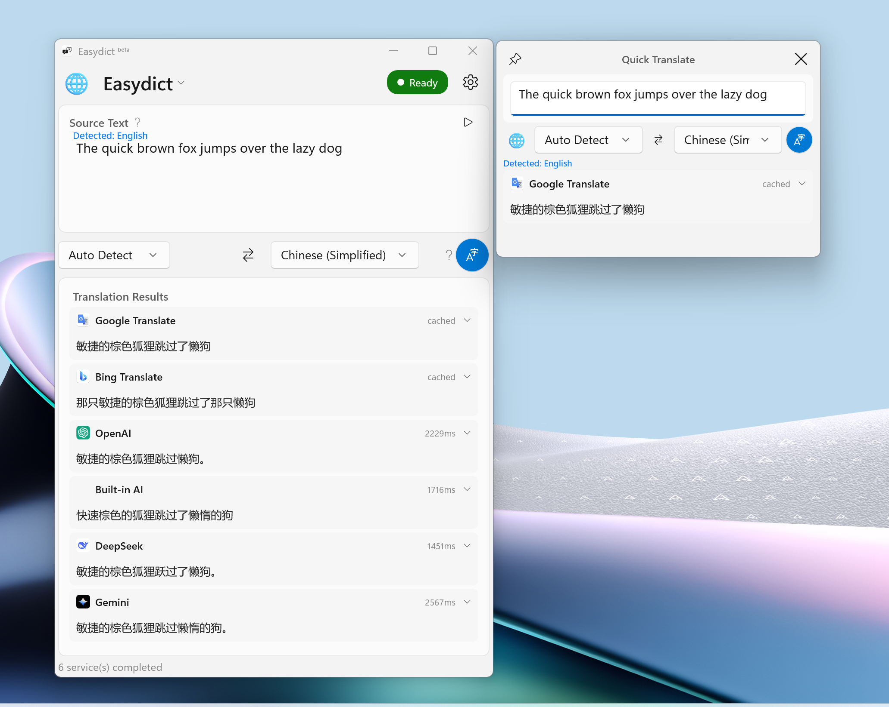
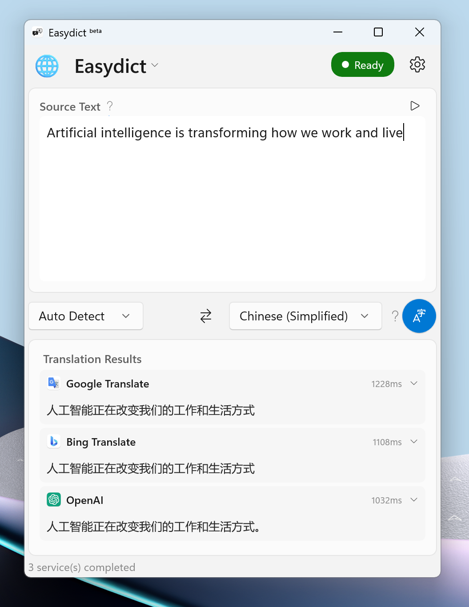
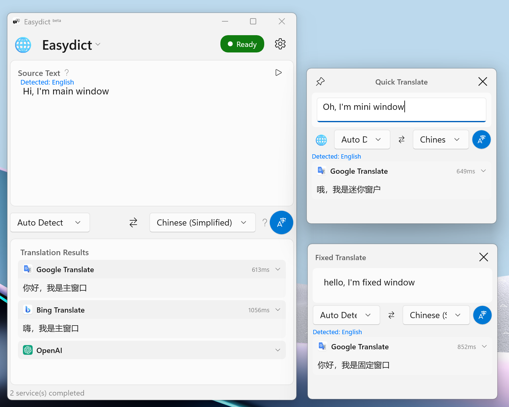
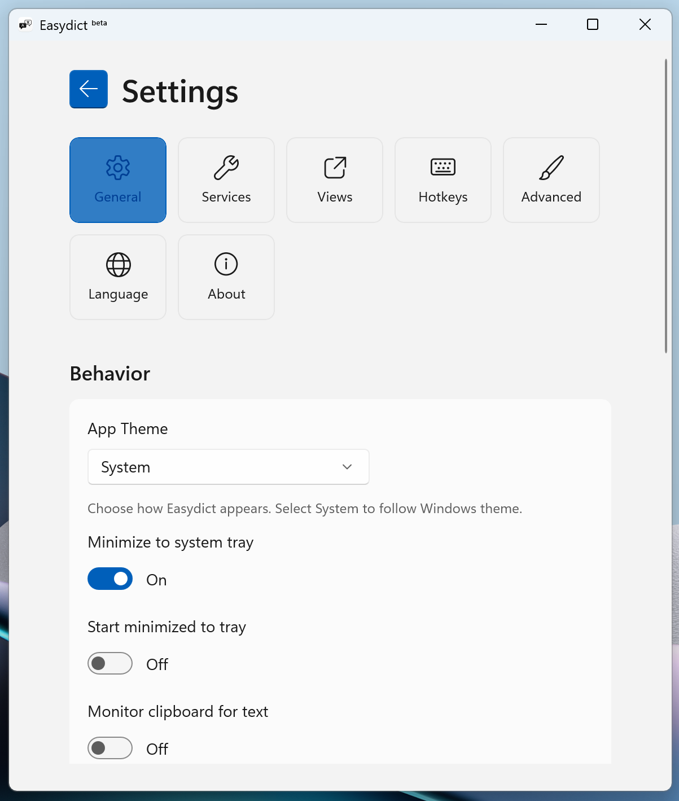
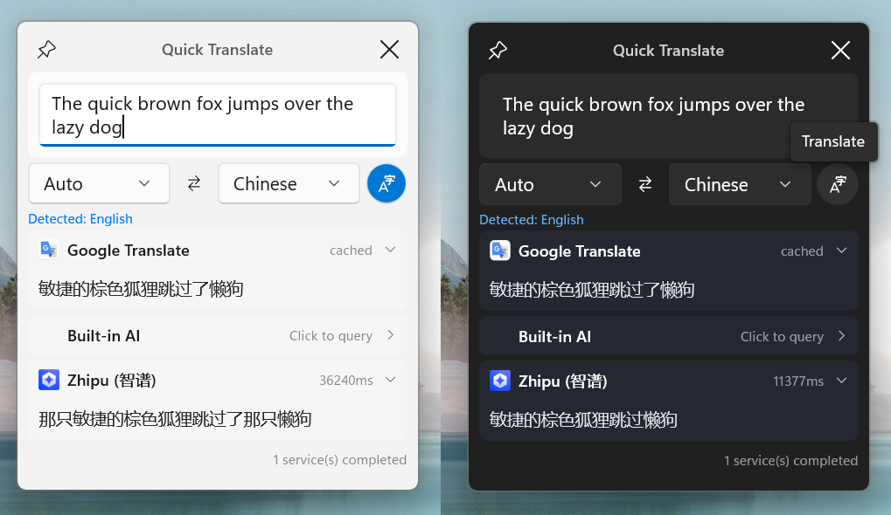

<p align="center">
  
  <h1 align="center">Easydict <sup><sub>for Windows</sub></sup></h1>
  <h4 align="center">轻松查词翻译</h4>
  <p align="center">A Windows port of <a href="https://github.com/tisfeng/Easydict">Easydict</a></p>
</p>

<div align="center">
<a href="./README.md">English</a> &nbsp;&nbsp;|&nbsp;&nbsp; <a href="./README_ZH.md">中文</a>
</div>

<div align="center">

[](https://github.com/xiaocang/easydict_win32/actions/workflows/ci.yml) [](https://www.gnu.org/licenses/gpl-3.0) 

<a href="https://apps.microsoft.com/detail/9p7nqvxf9dzj">
  
</a>

</div>

## 目录

- [简介](#简介)
- [功能](#功能)
- [安装](#安装)
- [技术栈](#技术栈)
- [翻译服务集成测试](#翻译服务集成测试)
- [待办事项](#待办事项)
- [与 macOS 版本对比](#与-macos-版本对比)
- [许可证](#许可证)
- [致谢](#致谢)

## 简介

这是 [Easydict](https://github.com/tisfeng/Easydict) 的 Windows 移植版本，原版是一款 macOS 翻译词典应用。本项目使用 **Vibe Coding** — AI 辅助编程，将 Swift/SwiftUI 代码库迁移到 .NET + WinUI 3。

虽然功能尚未完全对齐 macOS 版本，但此移植版填补了 Windows 用户对便捷翻译工具的需求，支持全局快捷键和多种翻译服务。

<p align="right"><a href="#目录">回到顶部</a></p>

## 功能

### 已实现

- **多种翻译服务**
  - Google 翻译（免费，无需 API Key）
  - Google 词典（丰富词典：音标、释义、例句）
  - 必应翻译（免费，无需 API Key）
  - DeepL（支持 Free/Pro API，支持繁体中文）
  - OpenAI（GPT-4o、GPT-4o-mini 等）
  - Gemini（Google AI，包括 Gemini 2.5 模型）
  - DeepSeek（深度求索）
  - Groq（快速 LLM 推理）
  - 智谱 AI
  - GitHub Models（免费）
  - 豆包（字节跳动翻译专用模型）
  - 火山翻译（字节跳动）
  - 彩云小译（支持繁体中文）
  - 小牛翻译（450+ 语种，支持繁体中文）
  - Linguee 词典（带上下文例句）
  - Ollama（本地 LLM，默认：llama3.2）
  - 内置 AI（免费，由 Groq 提供）
  - 自定义 OpenAI 兼容服务

- **LLM 流式翻译** - 实时显示翻译结果

- **多种窗口模式**
  - 主窗口 - 完整翻译界面
  - 迷你窗口 - 紧凑浮动窗口
  - 固定窗口 - 常驻翻译窗口

- **全局快捷键**
  - `Ctrl+Alt+T` - 显示/隐藏主窗口
  - `Ctrl+Alt+D` - 翻译剪贴板内容
  - `Ctrl+Alt+M` - 显示迷你窗口（自动复制选中文本并翻译）
  - `Ctrl+Alt+F` - 显示固定窗口
  - `Ctrl+Alt+S` - OCR 截图翻译
  - `Ctrl+Alt+Shift+S` - 静默 OCR（复制识别文字到剪贴板）
  - `Ctrl+Alt+Shift+M` - 切换迷你窗口可见性
  - `Ctrl+Alt+Shift+F` - 切换固定窗口可见性

- **系统托盘** - 最小化到托盘，后台运行

- **剪贴板监听** - 自动翻译复制的文本

- **HTTP 代理支持** - 配置代理服务器

- **高 DPI 支持** - Per-Monitor V2 DPI 感知

- **划词翻译** - 在任意应用中选中文本（拖拽、双击或三击），点击浮动翻译按钮即可在迷你窗口中翻译

- **OCR 截图翻译** - 类似 Snipaste 的截图体验：按 `Ctrl+Alt+S` 截取屏幕区域，自动检测窗口或拖拽选择区域，然后 OCR 识别文字并翻译。使用 Windows OCR API，支持配置识别语言。还支持静默 OCR（`Ctrl+Alt+Shift+S`），将识别文字复制到剪贴板而不翻译。

- **深色/浅色主题** - 跟随系统主题

- **TTS（文字转语音）** - 使用 Windows Speech Synthesis 朗读原文和译文

- **40+ 语种支持** - 在设置中自定义可用语种，从 40 多种语言中选择显示在源语言/目标语言选择器中的语种，涵盖东亚、欧洲、中东、南亚和东南亚语言

### 截图



*主窗口与迷你窗口（快速翻译）*

| 主窗口 | 所有窗口 | 设置 |
|--------|---------|------|
|  |  |  |
| 完整翻译界面 | 主窗口 + 迷你窗口 + 固定窗口及快捷键设置 | 服务配置 |



*浅色与深色模式 — 迷你窗口（快速翻译）*

<p align="right"><a href="#目录">回到顶部</a></p>

## 安装

### 系统要求

- Windows 10 版本 2004（内部版本 19041）或更高版本
- x64 或 ARM64 处理器

### 通过 winget 安装

```powershell
winget install xiaocang.EasydictforWindows
```

### 下载

从 [Releases](https://github.com/xiaocang/easydict_win32/releases) 页面下载。

#### 便携版（推荐）

**文件：** `easydict_win32-vX.Y.Z-x64.zip`

- 无需安装 - 解压即用
- 无需管理员权限
- 自包含（内含 .NET 运行时）
- 首次运行可能触发 Windows SmartScreen 警告 - 点击「更多信息」→「仍要运行」

```powershell
# 解压并运行
Expand-Archive easydict_win32-v1.0.0-x64.zip -DestinationPath Easydict
.\Easydict\Easydict.WinUI.exe
```

#### 验证下载（可选）

每个发布版本都包含 SHA256 校验和文件。

```bash
# Linux/macOS/WSL
sha256sum -c checksums-x64.sha256 --ignore-missing

# PowerShell
$expected = (Get-Content checksums-x64.sha256 | Select-String "easydict_win32").ToString().Split()[0]
$actual = (Get-FileHash easydict_win32-v1.0.0-x64.zip -Algorithm SHA256).Hash.ToLower()
if ($expected -eq $actual) { "OK" } else { "FAILED" }
```

### 从源码构建

```powershell
# 克隆仓库
git clone https://github.com/xiaocang/easydict_win32.git
cd easydict_win32/dotnet

# 构建
dotnet build src/Easydict.WinUI/Easydict.WinUI.csproj -c Release

# 运行
dotnet run --project src/Easydict.WinUI/Easydict.WinUI.csproj
```

<p align="right"><a href="#目录">回到顶部</a></p>

## 技术栈

- **.NET** - 运行时框架
- **WinUI 3 (Windows App SDK)** - 现代 Windows UI 框架
- **C#** - 编程语言
- **xUnit + FluentAssertions** - 单元测试

<p align="right"><a href="#目录">回到顶部</a></p>

## 翻译服务集成测试

| 服务 | 协议 | 状态 | 备注 |
|------|------|:----:|------|
| Google 翻译 | REST | ✅ | 免费，无需 API Key |
| 必应翻译 | REST | ✅ | 免费，无需 API Key |
| 有道 | REST | ✅ | Web + OpenAPI |
| OpenAI | OpenAI API | ✅ | |
| DeepSeek | OpenAI API | ✅ | |
| Gemini | Gemini API | ✅ | 自定义 SSE 流式协议 |
| 智谱 AI | OpenAI API | ✅ | |
| 火山翻译 | REST | ✅ | HMAC-SHA256 签名 |
| Groq | OpenAI API | — | OpenAI 兼容，缺少 API Key |
| GitHub Models | OpenAI API | — | OpenAI 兼容，缺少 API Key |
| 豆包 | Custom SSE | — | 缺少 API Key |
| DeepL | REST | — | 缺少 API Key |
| 彩云小译 | REST | — | 缺少 API Key |
| 小牛翻译 | REST | ✅ | |
| Linguee | REST | — | 未测试 |
| Google 词典 | REST | ✅ | |
| Ollama | OpenAI API | — | 需要本地 Ollama 环境 |
| 内置 AI | OpenAI API | — | 内置密钥 |
| 自定义 OpenAI | OpenAI API | — | OpenAI 兼容，用户自定义端点 |

> 标记为 **OpenAI API** 的服务均继承自 `BaseOpenAIService`，共享相同的 OpenAI 兼容实现，因此未测试的服务预期行为一致。

<p align="right"><a href="#目录">回到顶部</a></p>

## 待办事项

### 高优先级

- [x] ~~**豆包**~~ - 字节跳动 LLM 服务 ✅ **已实现**
- [x] ~~**彩云小译**~~ ✅ **已实现**
- [x] ~~**小牛翻译**~~ - 450+ 语种 ✅ **已实现**
- [x] ~~**Linguee 词典**~~ - 带上下文例句的词典 ✅ **已实现**
- [x] ~~**TTS（文字转语音）**~~ - Windows Speech Synthesis API ✅ **已实现**
- [x] ~~**OCR 截图翻译**~~ - 类似 Snipaste 的截图体验，使用 Windows OCR API ✅ **已实现**

### 中优先级

- [ ] **更多翻译服务**
  - [x] ~~火山翻译~~（字节跳动）✅ **已实现**

- [ ] **AI 工具**
  - [ ] 文本润色
  - [ ] 文本摘要

- [ ] **更多快捷键**
  - [ ] 润色并替换
  - [ ] 翻译并替换

### 低优先级

- [ ] **词典模式** - 单词释义、发音
- [ ] **智能查询** - 根据文本类型自动选择翻译模式
- [ ] **多语言界面** - UI 本地化
- [ ] **自动更新** - 检查并安装更新

### 分发

- [x] **Windows 商店** - 已上架 Microsoft Store
- [x] ~~**winget**~~ - 已发布到 Windows 包管理器 ✅

<p align="right"><a href="#目录">回到顶部</a></p>

## 与 macOS 版本对比

| 功能 | macOS | Windows |
|------|-------|---------|
| 翻译服务 | 25+ | 18 |
| OCR 截图翻译 | 支持 | 支持 |
| TTS | 支持 | 支持 |
| 划词翻译 | 支持 | 支持 |
| 窗口类型 | 3 | 3 |
| 全局快捷键 | 10+ | 8 |
| LLM 流式翻译 | 支持 | 支持 |
| 繁体中文 | 支持 | 支持 |

<p align="right"><a href="#目录">回到顶部</a></p>

## 许可证

GPL-3.0 - 仅供学习和交流使用。使用源代码时必须包含许可证和版权声明。

<p align="right"><a href="#目录">回到顶部</a></p>

## 致谢

- [Easydict](https://github.com/tisfeng/Easydict) - macOS 原版
- [Windows App SDK](https://github.com/microsoft/WindowsAppSDK) - WinUI 3 框架

---

*本项目使用 Vibe Coding 开发，由 Claude (Anthropic) 提供 AI 辅助编程。*
