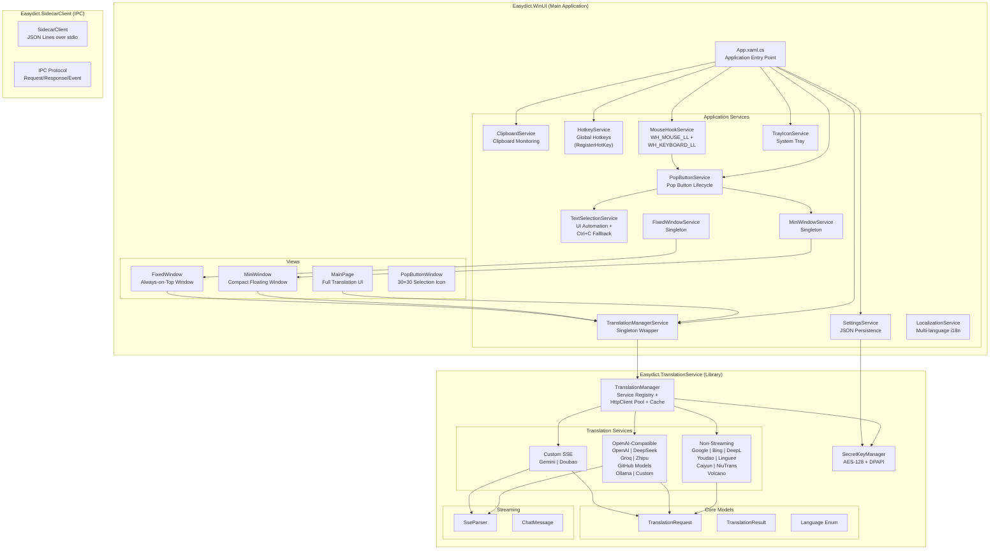
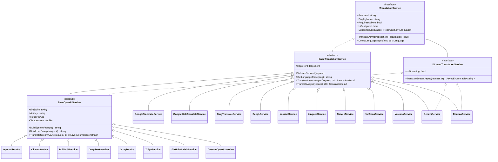
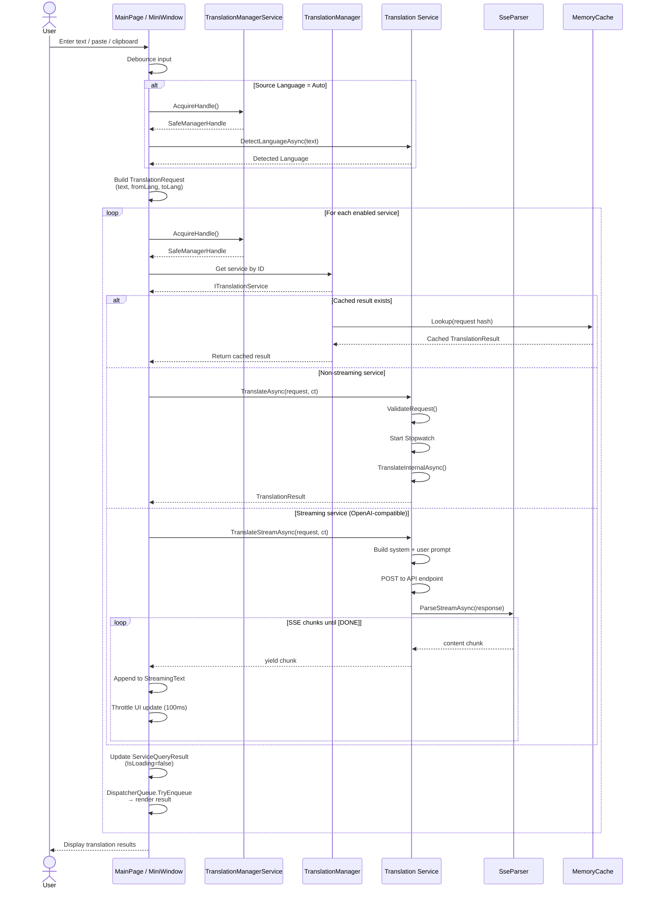
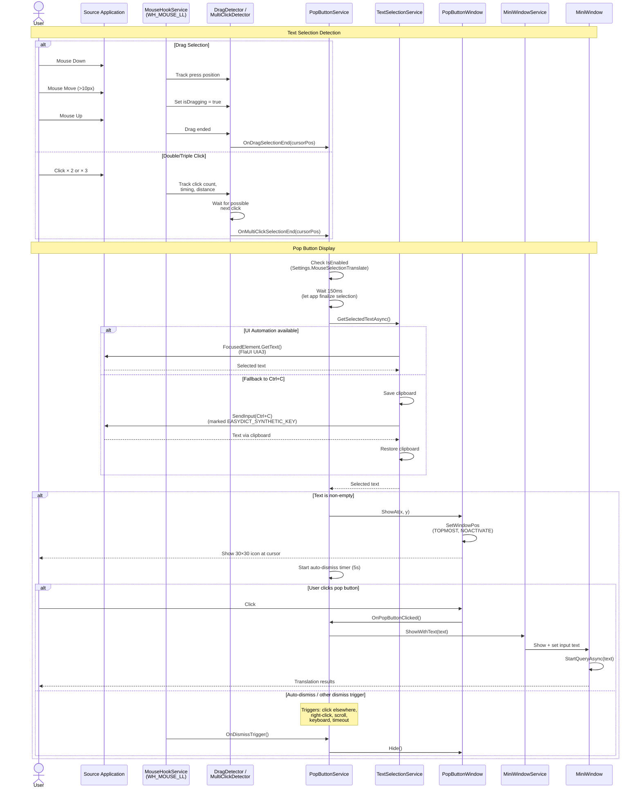
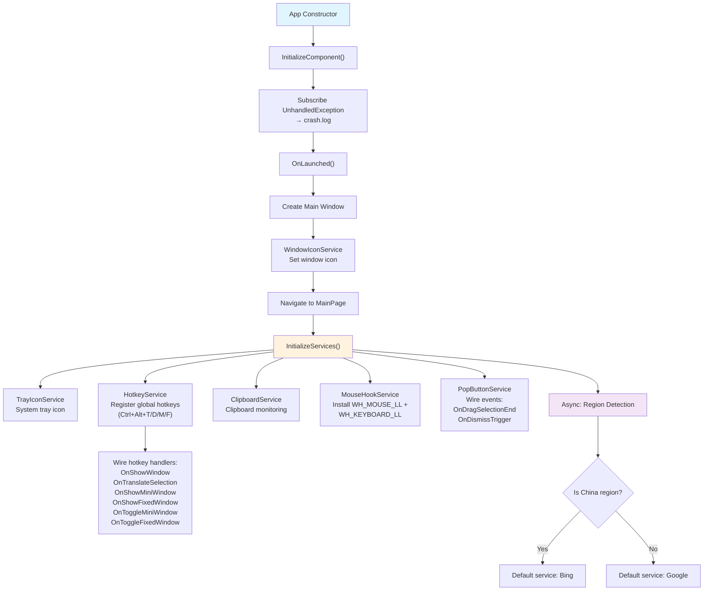
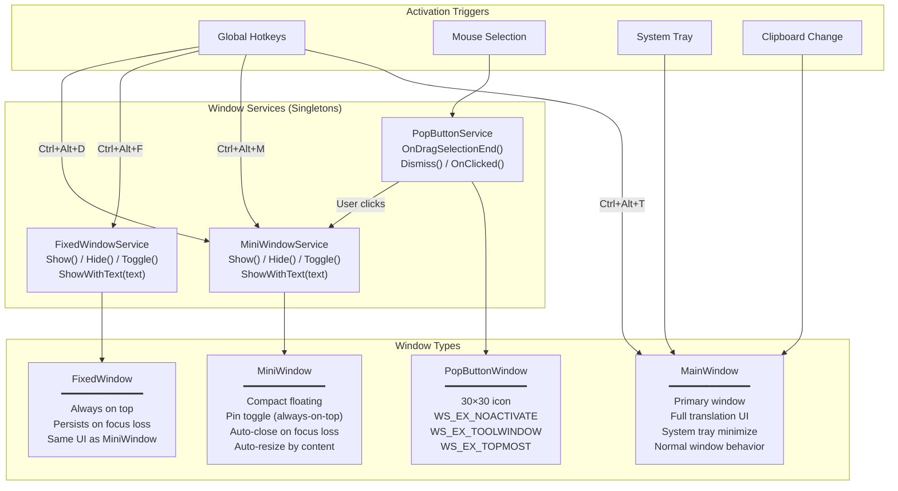
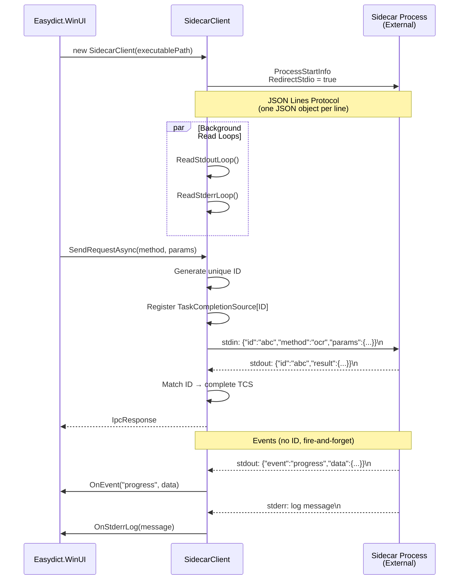
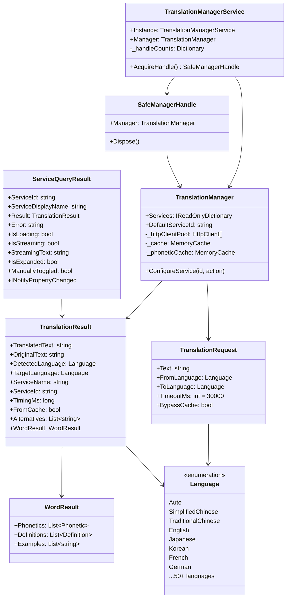
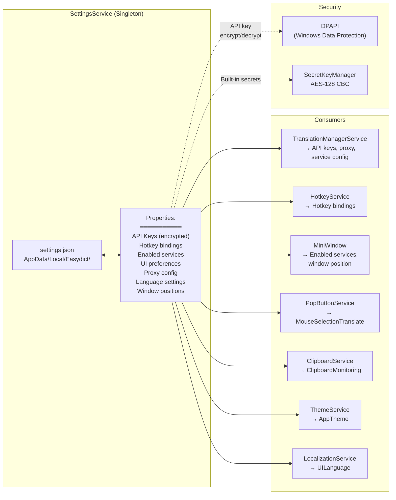
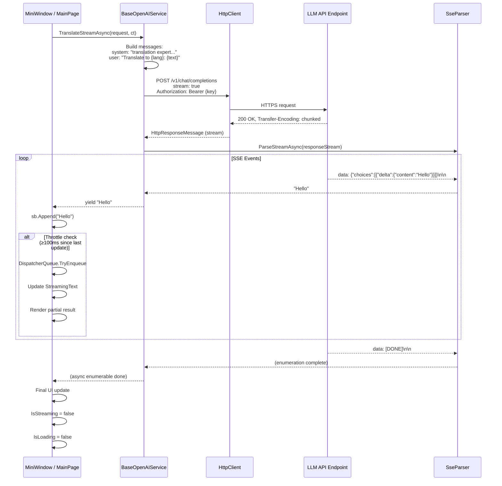

# Easydict Win32 Architecture Diagrams

## 1. Overall System Architecture

## 2. Translation Service Class Hierarchy

## 3. Translation Request Flow

## 4. Mouse Selection Translate (Pop Button) Flow

## 5. Application Initialization Flow

## 6. Window Management Architecture

## 7. IPC / Sidecar Architecture

## 8. Data Model Relationships

## 9. Settings & Configuration Flow

## 10. Streaming Translation Detail

